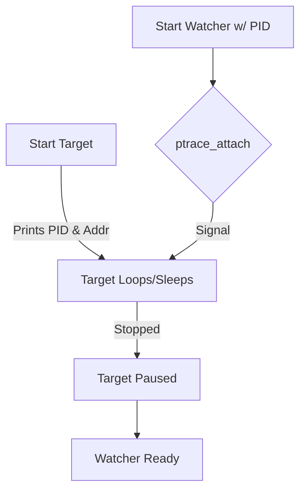
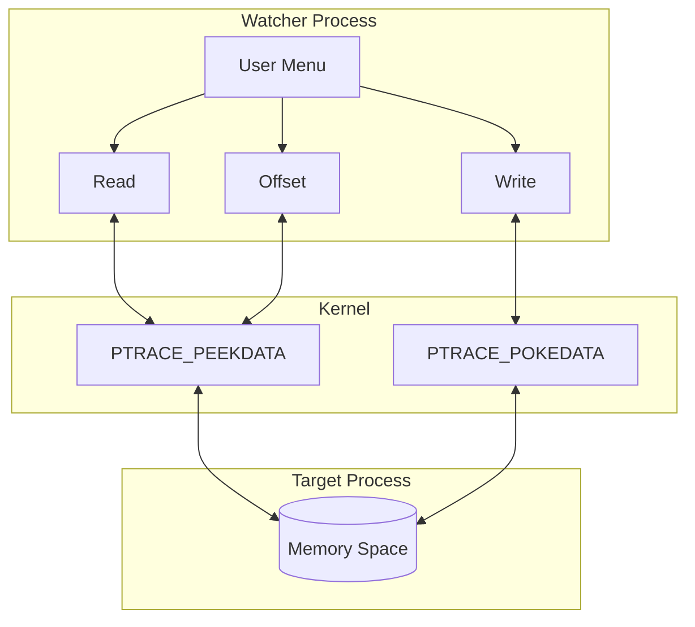

# ptrace memory editing tool
A C++ project designed to allow users to inspect and modify another process's memory using the `ptrace` system call.

## How it works
The project uses two programs: a **Target** that holds data in memory and a **Watcher** that attaches to it to read or change that data.


## System Flow

### 1. Attachment Phase
The Watcher must first "seize" the Target. This pauses the Target's execution so the memory stays static while we work.



### 2. Interaction Loop
Once attached, the Watcher can perform multiple operations before releasing the Target.



---

## Compilation & Setup
1. **Compile the Target:** `g++ target.cpp -o target`
2. **Compile the Watcher:** `g++ watcher.cpp -o watcher`
3. **Run the Target:** `./target`
4. **Run the Watcher:** `sudo ./watcher <PID>`

---


## Watcher Program Breakdown

### 1. Attachment
Before interacting with memory, we must take control of the target process.

```cpp
ptrace(PTRACE_ATTACH, pid, nullptr, nullptr);
waitpid(pid, &status, 0); // wait for program to freeze before continuing 
```
* **Attach:** Tells the OS to give control of the target PID to the watcher.
* **Wait:** Ensures the program is fully "frozen" so data doesn't change while we are reading it.

### 2. Reading Memory
The tool can look at a specific hex address provided by the user.

```cpp
int case_1_value = ptrace(PTRACE_PEEKDATA, pid, (void*)address_case_1, nullptr);
```
* **PEEKDATA:** Reads a word of data from the specified memory address in the target process.

### 3. Writing and Bitmasking
Writing requires extra care to ensure we don't overwrite more data than intended.

```cpp
long case_2_value = ptrace(PTRACE_PEEKDATA, pid, (void*)address_case_2, nullptr);
long masked = (case_2_value & 0xFFFFFFFF00000000) | (uint32_t)case_2_new_value;
ptrace(PTRACE_POKEDATA, pid, (void*)address_case_2, (void*)masked);
```
* **Read Current:** We first read the existing 64-bit value at the address.
* **Masking:** We combine the new value with the existing "upper bits" of the memory to avoid corruption.
* **POKEDATA:** Injects the final modified value back into the target process.


### 4. Reading with Offset
Useful for finding data relative to a known base address (like a struct or array).

```cpp
uint64_t target_address = base_address + offset;
int offset_value = ptrace(PTRACE_PEEKDATA, pid, (void*)target_address, nullptr);
```
* **Calculation:** Adds the byte offset to the base address to find the target location.
* **Access:** Reads the value at the newly computed address.

### 5. Type Reinterpretation
Memory is just raw bytes; this section shows how the same bytes can represent different things.

```cpp
int value = ptrace(PTRACE_PEEKDATA, pid, (void*)address, nullptr);
std::cout << "Interpreted as int: " << *(int*)&value;
std::cout << "Interpreted as char: " << *(char*)&value;
std::cout << "Interpreted as float: " << *(float*)&value;
```
* **Casting:** Takes the address of the raw data and tells the compiler to "view" it as a different data type (int, char, or float).

### 6. Detaching
Properly releasing the process allows it to continue running.

```cpp
ptrace(PTRACE_DETACH, pid, nullptr, nullptr);
```
* **Detach:** Relinquishes control and resumes the target process's execution.

---

## Troubleshooting
If you get a "Permission Denied" error even with `sudo`, your Linux distro might have `ptrace_scope` restricted. You can allow it with:
```bash
echo 0 | sudo tee /proc/sys/kernel/yama/ptrace_scope
```
